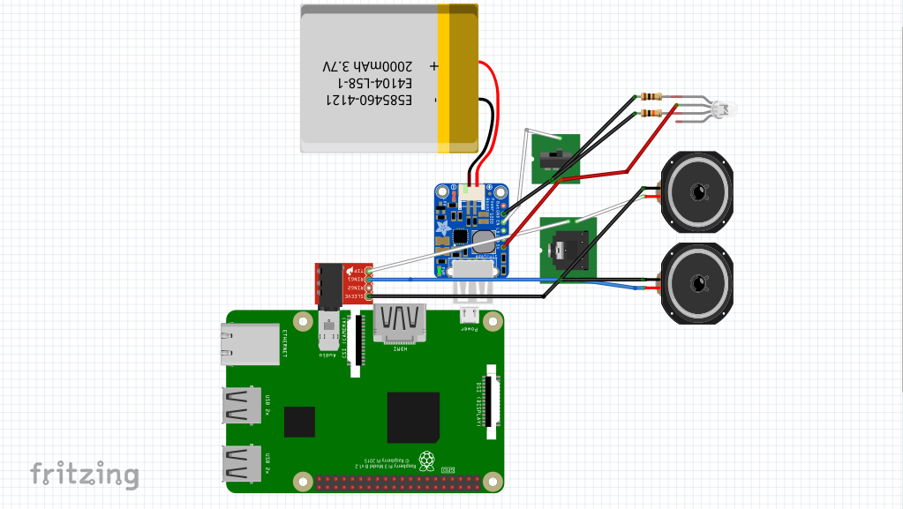
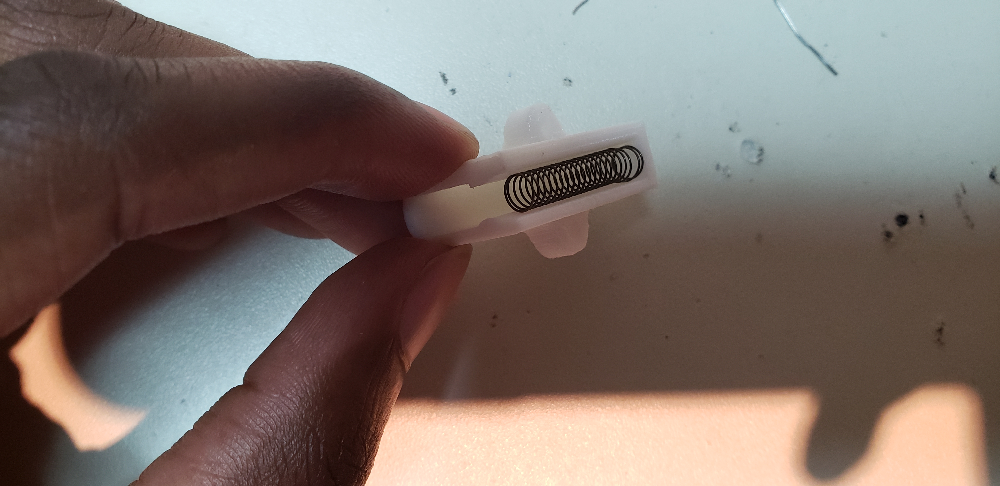
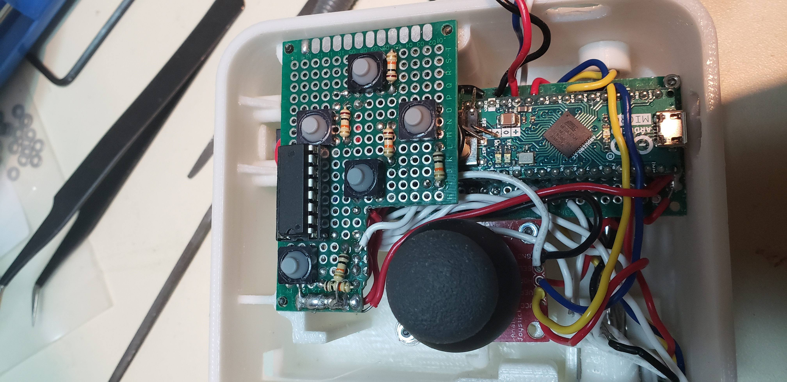

----
# Table of Contents #
{:.not_toc}

- TOC
{:toc}
----
**This repo is hosted on [Gitlab](https://gitlab.com/guyjeangilles/raspswitch.git). Any issues or pull requests on Github will be ignored and closed.**

# Introduction #
Welcome to the RaspSwitch repo. The steps in this readme instruct how to make
a Nintendo Switch-inspired handheld retro-gaming console. What makes this unique to other
variants is a DIY bluetooth, collapsible gamepad deemed the _DuinCon_.
 Heavy inspiration from the [SwitchBerry.](https://github.com/drew-wallace/switchberry)

# Design Overview #
Below are wiring diagrams of the RaspSwitch. These are for **reference only**.
Make sure you understand each component's function.

## Console ##

The console consists of a Raspberry Pi 3 A+ and the HyperPixel 4.0 as the display. A Powerboost 1000c and a 2500mAh lithium battery supply power. In practice, the battery life is ~1.5 hours. You can use an external battery pack to lengthen that. There's also circuitry to turn the console on and off with a switch, a power LED that turns on when the battery is low, and electronics that switch audio from the built-in speakers to headphones if they're plugged in.

_NOTE: I want to reiterate that the above is just for reference. Several elements are not in the fritzing diagram including the HyperPixel 4.0, USB cable from the PowerBoost 1000c, etc._

## DuinoCon ##

The bluetooth gamepad is fairly simple. It's main components are an Arduino Micro, two shift registers, two thumb joysticks, and a blueSMIRF module. A 1200mAh lithium ion battery and Powerboost 1000c supply power. I was getting 4+ hours of use from this battery. Mechanically speaking, the gamepad is one unit that can collapse instead of two separate gamepads like the Nintendo Switches joycons. I'll be honest, separate gamepads are probably more functional than a collapsible gamepad, but at least now you can learn from my mistakes.

# Full Component List #
- [Raspberry Pi A+ (USD 25.00 Oct2019)](https://www.adafruit.com/product/4027)
- [Arduino Micro (USD 19.80 Oct2019)](https://store.arduino.cc/usa/arduino-micro)
- [Hyperpixel 4.0 display (£36.50 Oct2019)](https://shop.pimoroni.com/products/hyperpixel-4)
- [blueSMIRF Silver (USD 27.95 Oct2019)](https://www.sparkfun.com/products/12577)
- [6" USB cable (USD 2.95 Oct 2019)](https://www.adafruit.com/product/898)
- [SN74HC165N shift register (USD 0.48 Oct2019)](https://www.digikey.com/product-detail/en/texas-instruments/SN74HC165N/296-8251-5-ND/376966)
- [M2 threaded inserts (USD 13.20)](https://www.mcmaster.com/94180a312)
- [M2x6 fasteners (USD 12.05 Oct2019)](https://www.mcmaster.com/91290a013)
- [M2x3 fasteners (USD 8.74)](https://www.mcmaster.com/91292a003)
- [M2 hex nuts (USD 4.11)](https://www.mcmaster.com/90695a025)
- [M2 washers (USD 1.06)](https://www.mcmaster.com/93475a195)
- [3" linear shaft (USD 4.56)](https://www.mcmaster.com/6061k411)
- [5" linear shaft (USD 5.07)](https://www.mcmaster.com/6061k413)
- [0.938" spring (USD 5.24)](https://www.mcmaster.com/9657k810)
- [0.5" spring (USD 7.87)](https://www.mcmaster.com/9657k268)
- [2500mAh Lithium ion battery (USD 14.95 Oct2019)](https://www.adafruit.com/product/328)
- [1200mAh Lithium ion battery (USD 9.95 Oct2019)](https://www.adafruit.com/product/258)
- [Powerboost 1000c(USD 19.95 Oct2019)](https://www.adafruit.com/product/2465)
- [Protoboards (USD 8.99 Oct2019)](https://www.amazon.com/Teenitor-Prototype-Project-Quality-Universal/dp/B01IONQQ3Y/ref=sr_1_1?keywords=teenitor+prototype&qid=1570403288&sr=8-1)
- [3.5 mm audio plug (USD 2.50 Oct2019)](https://www.adafruit.com/product/2914)
- [3.5 mm audio jack (USD 0.95 Oct2019)](https://www.adafruit.com/product/1699)
- [Right angle HDMI adapter (USD 7.99 Oct2019)](https://www.amazon.com/DIZA100-4-Pack-Connectors-2-Pack-Adapters/dp/B01GFP4NQA/ref=sr_1_fkmr0_1?keywords=diza100+4+pack+hdmi+adapter+any+angle&qid=1570404308&sr=8-1-fkmr0)
- [RGB led (USD 2.00 Oct2019)](https://www.adafruit.com/product/159)
- [SPDT switch (USD 0.95 Oct2019)](https://www.adafruit.com/product/805) _this is a little smaller than what the 3D printed parts call for but will still work_
- [Soft tactile momentary switch (USD 1.95 Oct2019)](https://www.adafruit.com/product/3101)
- [0.5W 1" speaker (USD 1.95 Oct2019)](https://www.adafruit.com/product/1890)
- [10k ohm resistors (USD 0.75 Oct2019)](https://www.adafruit.com/product/2784)
- [100 ohm resistor (USD 0.75 Oct2019)](https://www.adafruit.com/product/4293)
- [DIP IC sockets (USD 10.84 Oct2019)](https://www.amazon.com/Glarks-122Pcs-Sockets-Adaptor-Assortment/dp/B01GOLSUAU/ref=sr_1_fkmr0_1?keywords=clarks+122pcs+2.54mm+pitch+dip&qid=1570404830&sr=8-1-fkmr0)
- [Thumb joystick USD 3.95 Oct2019](https://www.sparkfun.com/products/9032)
- [Thumb stick breakout board (USD 1.95 Oct2019)](https://www.sparkfun.com/products/9110)
- Access to a 3D printer

# Setting up the blueSMIRF as an HID Device #
0. Load the Arduino Micro with command mode test firmware.
1. Send `$$$<cr>` via the serial monitor to enter command mode.
2. Send `SU,96` to change the baud rate to 9600 bps.
3. Send `S~,6` to switch the module to the HID profile.
4. Send `R,1` to reboot.
5. Send `SH,0220` to make the module a gamepad.
6. Send `GH` to check that it changed. The response needs to be `SA,1` or at least not `SA,0` to work.

# Test the gamepad functionality #
0. Follow the instructions in the firmware comments to wire the components on a breadboard.
Use the wiring diagrams and schematic as reference only. **DO NOT SOLDER ANYTHING YET.**
1. Connect to any bluetooth capable device and ensure the blueSMIRF is seen as a bluetooth joystick and all the buttons and analog axes work. I used [jstest-gtk](https://jstest-gtk.gitlab.io/) for debugging. There's probably a similar program for your OS.

# Setting up RetroPie #
0. Ensure you have a USB keyboard and a Ethernet connection.
1. Download RetroPie image.
2. Use [Etcher](https://www.balena.io/etcher/) (our your favorite image burning tool) to install RetroPie on a micro SD card.
3. Boot RetroPie on the Raspberry Pi.
4. Configure a USB keyboard as a RetroPie controller.
5. Update RetroPie.
6. Change the timezone to yours.
7. Change the keyboard layout to one you're familiar with.
8. Connect to wifi.
9. Enable autologin.
10. Enable SSH and change the password.
11. Register the DuinoCon as a bluetooth gamepad.
12. Configure DuinoCon as a RetroPie controller.
13. Force reconnection in background.
14. Install the HyperPixel 4.0 software with `curl https://get.pimoroni.com/hyperpixel4 | bash`
more info at https://learn.pimoroni.com/tutorial/sandyj/getting-started-with-hyperpixel-4

_NOTE: I've tried to configure the Raspberry Pi to switch between HDMI and the HyperPixel but have had modest success. You can read  up on it here and take your best shot https://forums.pimoroni.com/t/hyperpixel-selective-output-eg-on-boot/5193/3 ._

# Mechanical Assembly Sanity Check #
0. 3D print all the parts.

1. Before you install the threaded inserts,  you should assemble the 3D printed parts to make sure they mate as intended. You'll likely have to do some post-processing depending on the 3D printer you use. I modeled the parts to have excess material so they could be printed on any printer and be post-processed for proper assembly. Use the following steps as a minimum checklist for part assembly.

2. A micro SD card should be able to **slip** through slot on the side of the console. It should not stick...like at all.

3. The port for the headphone jack, SPDT switch, and RGB led  should **slip** into it's hole in the front of the console enclosure. A little sticktion is ok.

4. The console's tabs should **slip** into the gamepads slots. There should be **zero** stick...like at all.

5. The slide bay should **slip** into the two halves of the gamepads. There should be **zero** stick...like at all.

6. The linear shaft should **slip** into the shaft guide. A little sticktion is ok.

7. The console release tip should **slip** through it's housing in left gamepad half. There should be **zero** stick...like at all.

8. The console catch should **slip** though it's housing in the left gamepad half. There should be **zero** stick...like at all.

9. A spring should rest in the right gamepad catch enclosure when it's flipped upside down.

10. The assembled right gamepad catch should **slip** in and out of it's enclosure. There should be **zero** stick...like at all.

# Full Assembly #

_NOTE:_ I'd recommend only charging one battery and leaving another in a low/near-dead state to troubleshoot the low battery fuction of the 1000C.

_ANOTHER NOTE:_ I'd recommend using stranded wire as it's more flexible than solid core.

_ONE MORE NOTE:_ You will need to cut the protoboards I link to in the full component list. I did this easily with a dremel tool.

## Console Assembly ##

### Console Component list ###

- Raspberry Pi A+ x1
- Hyperpixel 4.0 display x1
- GPIO header extension x1
- M2.5 mm shoulder x4
- M2.5 fasteners x4
- M2 threaded inserts x12
- M2x6 fasteners x10
- M2x3 fasteners x2
- 2500mAh Lithium ion battery x1
- Powerboost 1000c x1
- Appropriately sized protoboard for audio/power circuit x1
- 3.5 mm audio jack x1
- 3.5 mm audio plug x1
- Right angle HDMI adapter x1
- RGB led x1
- SPDT switch x1
- 0.5W 1" speaker x2
- 10k ohm resistor x1
- 10 ohm resistor x1
- all 3D printed parts

0. Test your components on a breadboard

1. Seriously, save yourself some time and connect everything, raspberry pi, Arduino, all the components on a breadboard and use the joysticks, buttons, headphone jacks, switches...test all of this before you start soldering anything.

2. Make sure you did the mechanical assembly right.

3. I'm being repetitive but seriously if you skipped the mechanical assembly part above go back up and do it.

4. Solder the audio/power PCB including the Powerboost 1000c, 3.5mm plug, and speakers that I forgot to solder in the photo below.

5. Test that the audio jack and speakers work in a known good audio source. Also, check that the LED turns green and red as expected and the slide switch works.

6. Install the threaded inserts in the top and bottom half of the console enclosures.

7. Install the audio/power PCB, don't install the Powerboost 1000c yet. The M2X3 fastener works best here.

8. Install the HDMI adapter and3.5mm plug onto the Pi. Then install the Pi into the bottom half of the console enclosure **without** the micro SD card.  It's easiest to slide the Pi in sideways.

9. Install the Powerboost 1000c, but don't fasten down the fastener too tight as you might need to adjust it for the next step. The M2x3 fastener works best here.

10. Attach a USB cable to the Powerboost 1000c and Raspberry Pi. You might need to push down the LED wires to accomplish this.

11. Install the threaded inserts and header pin extender onto the Hyperpixel 4.0. Then install the Hyperpixel 4.0 onto the Raspberry Pi. Once the screen is on, screw in the fasteners included with the display (M2.5) from the bottom half of the console into the raspberry pi.

12. Install the speakers into the top half of the console. M2x6 fasteners works best here.

13. Install the top half of the console enclosure onto the bottom half of the enclosure. Use M2x6 fasteners.

## Gamepad Assembly ##

_NOTE:_ This is a complex soldering assembly. No less than 7 boards need to be soldered to the Arduino in some way. It's worth your time and sanity to review the circuit to make sure you understand what each wire is for. You may also want to practice making solder bridges.

### Component List ###

- Arduino Micro x1
- 20 pin DIP IC socket x1
- Powerboost 1000c
- M2 threaded inserts x17
- M2x6 fasteners x17
- M2 hex nuts x4
- M2 washers x4
- blueSMIRF
- 1200mAh lithium ion battery
- Joystick x2
- Joystick breakout board x2
- appropriately sized protoboard for the right gamepad face buttons x1
- appropriately sized protoboard for the left gamepad face buttons x1
- appropriately sized protoboard for the shoulder buttons x2
- 3cmx7cm protoboard x1
- Soft tactile momentary swtich x14
- 10k ohm resistor x15
- 100 ohm resistor x1
- SN74HC165N PISO shift register x2
- 16 pin DIP IC socket x2
- 3" linear saft x2
- 5" linear shaft x2
- 0.938" spring 1
- 0.5" spring x 3
- all 3D printed parts

0. Did you test the components on a breadboard? Because if you didn't your going to have a bad time.

1. Assemble all your components and place them on their respective boards.

_NOTE:_ To ease debugging, these steps will instruct to only solder the components for the right half of the gamepad then test the circuit.

_ANOTHER NOTE:_ Depending on the gauge wire/DIP IC socket leads/protoboard you're using, the hookup wire AND the DIP IC lead  could fit in one through hole. It will make soldering a lot neater if you consolidate.

_ONE LAST NOTE:_ You'll need to bend the leads of the ISP on the Arduino Micro as shown in the picture above.

2. Solder *ONLY* the 5V and GND pins of the Arduino Micro to the protoboard. Make sure it's in a location that aligns with the USB access port in the bottom half of the right gamepad enclosure. Solder the 5V and GND pins of the Powerboost 1000c to the 5V and GND pins of the Arduino Micro. Check your soldering by powering on the Arduino Micro.

_NOTE:_ The VS pin should be soldered directly to the SPDT Switch, but everything else that requires 5V, (Arduino, buttons, etc.), should be connected to the 5V pin of the Powerboost.

3. Solder the SPDT switch, RGB led, and accompanying resistors to the protoboard. I used the solder pads as power and ground planes, but you can solder your own way if you like. Check your soldering by turning the Arduino Micro on and off with the switch.

4. Solder all of the components for the right half of the gamepad, connect the electronics to a bluetooth compatible device and check that everything works. Don't solder any of the components for the left half of the gamepad yet.

5. Install the M2 threaded inserts into the shaft guides.

6. Install the 5" linear shafts in the dual shaft bay and install the M2 threaded inserts into the dual shaft bay.

7. Insert the 3" linear shafts into the shaft guide. Hold the shaft guide/linear shaft sub-assembly into place in the bottom gamepad halves and slide the dual shaft bay subassembly into place.

8. Fasten the end caps into place. Fasten the shaft guide into place.

9. Now we're going to switch back to electronics. Solder the second SN74HC165N PISO shift register, push buttons and accompanying resistors onto their PCBs. Solder VCC, GND, and SEL pins of the left joystick to this PCB assembly. *DO NOT* solder the HOR or VER pins yet.

10. Cut *long* (9"+ at the very least) pieces of hook up wire. You need 2 wires for 5V and GND, 2 wires for HOR and VER of the joystick, 4 wires for the SN74HC165N PISO shift register. Solder the remaining connections. Before you fasten any boards, connect the Arduino to a bluetooth capable device and make sure everything is working properly.

11. We're switching back to the 3D printed parts. Install M2 threaded inserts into the top and bottom half of the gamepad enclosures.

12. Install M2 threaded inserts into the right gamepad release slide and fasten it to the right gamepad catch.

13. Put the right gamepad catch and release assembly into place. Place the 0.938" spring into place. Fasten the enclosure.

14. Press fit the blueSMIRF into place.

15. Install the shoulder button PCB. M2x3 fasteners work best here. I found it easier to fasten this PCB with the DuinoCon on it's side.

16. Put Arduino Micro PCB into place and fasten it with a M2x3.

17. Place the joystick PCB into place and fasten it with a M2 hex nut and a washer in between the nut and joystick board.

18. Fasten the face button PCB into place and put the 3D printed buttons on the momentary switches. Put the top right half on top and fasten it into place.

19. The left gamepad assembly follows a similar procedure except for a key difference: the console catch and release. After installing the left thumb joystick, install the gamepad release tip.

20. Install three 0.5" springs into the console catch, then install the console catch into the left gamepad.

21. Install the rest of the PCBs and buttons as before and fasten the top into place. You're done!

